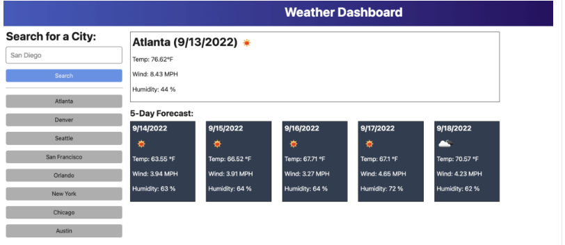

# 06 Server-Side APIs: Weather Dashboard

In this project, I eplored Third-party API. Third-party APIs allow developers to access their data and functionality by making requests with specific parameters to a URL. 
Developers are often tasked with retrieving data from another application's API and using it in the context of their own. Your challenge is to build a weather dashboard that will run in the browser and feature dynamically updated HTML and CSS.


## User Story

```
AS A traveler
I WANT to see the weather outlook for multiple cities
SO THAT I can plan a trip accordingly
```

## Acceptance Criteria

```
GIVEN a weather dashboard with form inputs
WHEN I search for a city
THEN I am presented with current and future conditions for that city and that city is added to the search history
WHEN I view current weather conditions for that city
THEN I am presented with the city name, the date, an icon representation of weather conditions, the temperature, the humidity, and the wind speed
WHEN I view future weather conditions for that city
THEN I am presented with a 5-day forecast that displays the date, an icon representation of weather conditions, the temperature, the wind speed, and the humidity
WHEN I click on a city in the search history
THEN I am again presented with current and future conditions for that city
```

## Mock-Up

The following image shows the web application's appearance and functionality:




Steps to develop this project:

To develop this project, I will Create a form in my HTML with an input field to capture the city name.

Add an event listener to the form to capture the city name when the form is submitted.

Use the captured city name to make an API request to retrieve the current and future weather conditions for that city.

Display the city name, date, weather icon, temperature, humidity, and wind speed on the page.

Display a 5-day forecast that includes the date, weather icon, temperature, wind speed, and humidity.

Store the searched city in the search history, either in localStorage or in an array.

Display the search history on the page and add event listeners to the search history items.

When a city in the search history is clicked, repeat steps 3-5 to display the current and future conditions for that city.


Here's a high-level example of how the code structure might look:


// Step 1: Capture the form and input field in variables
const form = document.querySelector('form');
const cityInput = document.querySelector('#city-input');

// Step 2: Add an event listener to the form
form.addEventListener('submit', function(event) {
  event.preventDefault();
  
  // Step 3: Retrieve the city name from the input field
  const cityName = cityInput.value;

  // Step 4: Make an API request to retrieve weather data for the city
  // Use the retrieved data to display the current weather conditions on the page

  // Step 5: Use the retrieved data to display the 5-day forecast on the page

  // Step 6: Store the searched city in the search history

  // Step 7: Display the search history on the page and add event listeners to the search history items

});

// Step 8: Add an event listener to the search history items
// When a search history item is clicked, repeat steps 3-5 to display the weather conditions for that city.

Here is a link to the project deployed  website:
https://obi1knube.github.io/Weather-Dashboard-Obiora/
The code can be found here :'https://github.com/Obi1knube/Weather-Dashboard-Obiora


